# Drive360_Android

This repository is Android portion of [Drive360](https://github.com/klmui/Drive360/). For most updated version of Android features, please clone this repo and check out. If you want to see the VR portion from Unity, please checkout the main repo. However, the setup might be tricky.

## Team Members
Khoa Thien Le (Harry), [ktle4@wisc.edu](mailto:ktle4@wisc.edu), GitHub: khoa165
Kenneth Mui, [klmui@wisc.edu](mailto:klmui@wisc.edu), GitHub: klmui
Monica Schmidt, [meschmidt@wisc.edu](mailto:meschmidt@wisc.edu), GitHub: monica22schmidt
Benjamin Carpenter, [blcarpenter@wisc.edu](mailto:blcarpenter@wisc.edu), GitHub: blcarpenter

## Summary

Drive 360 helps students in driver’s education classes learn the rules of driving by immersing them into interactive VR environments. It also provides a mobile-platform for users to post tips, take practice exams, share practice sets, and learn.

## Abstract/Introduce App

1.  “16-year olds have higher crash rates than drivers of any age”. With new advances in VR technology, people have sought to use it for educational purposes. In this case, we will use it to help people drive by providing an immersive VR experience.
    
2.  Users will be asked questions while the video is going on. The 360 video will pause when the app wants the user to complete a task. For example, to continue the 360 video, users will be required to look left, right, and left while they are at a stop sign, shoulder check while merging onto a highway or changing lanes, and look at mirrors when performing actions. Users will also be able to take a 360 tour of the inside of a car to get familiar with it.
    
3.  It is understandable that some people might be scared to get started with learning how to drive. The transition from reading manuals and rule books to actually driving the car might be uneasy for beginners. Aiming to alleviate the fear some might have, the app targets teenagers at the age of learning how to drive as well as people having anxious feelings while driving.

## Screenshots

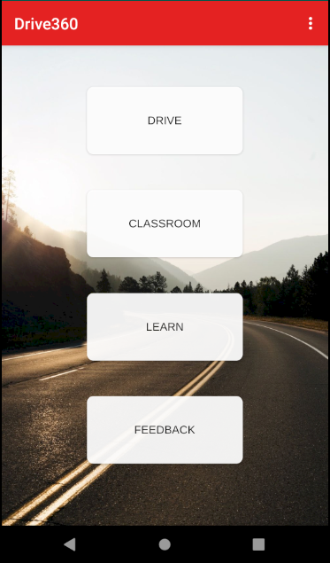

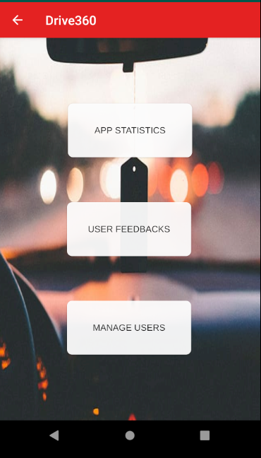

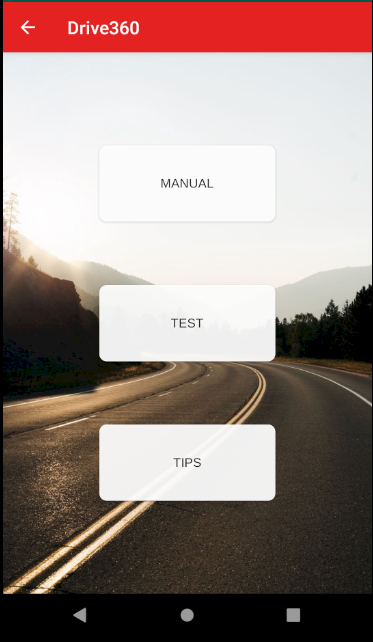

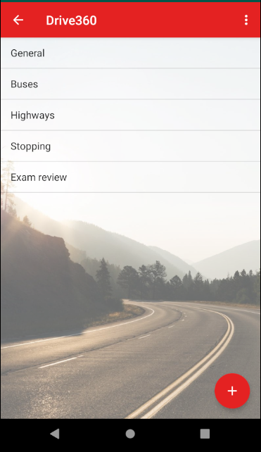

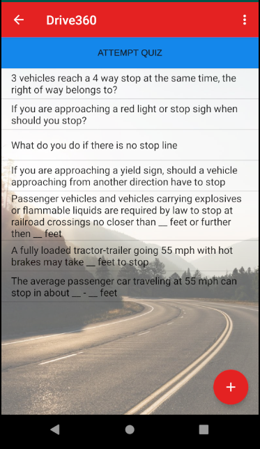

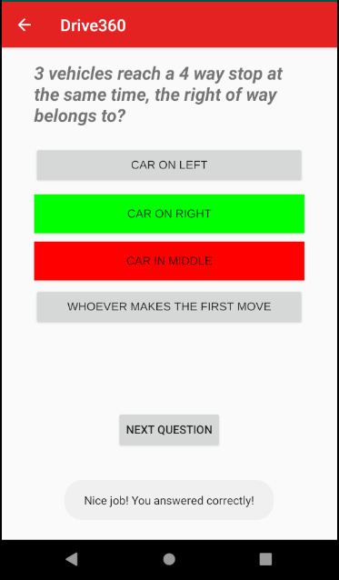

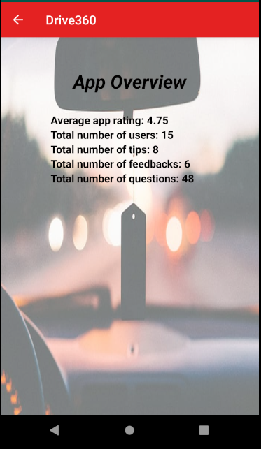

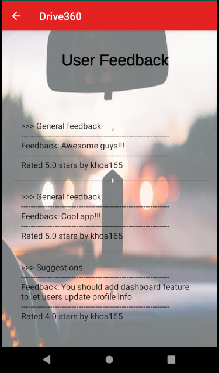

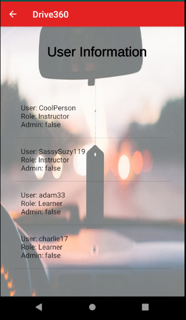

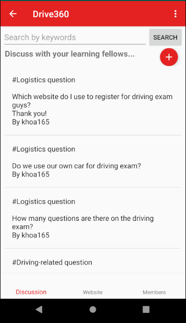

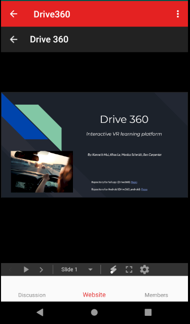

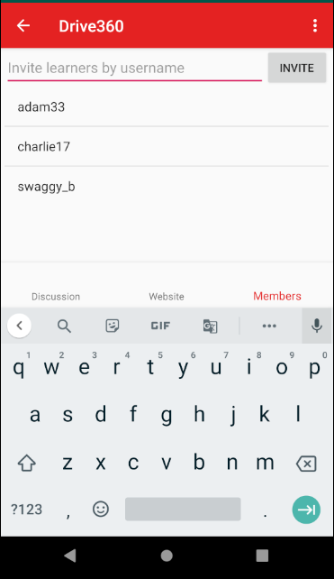

## Wireframes

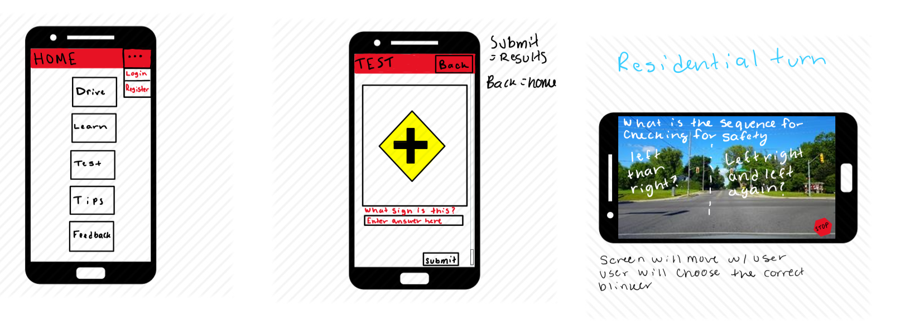

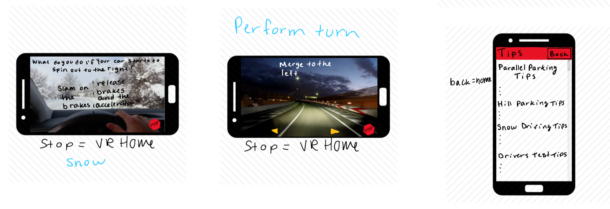

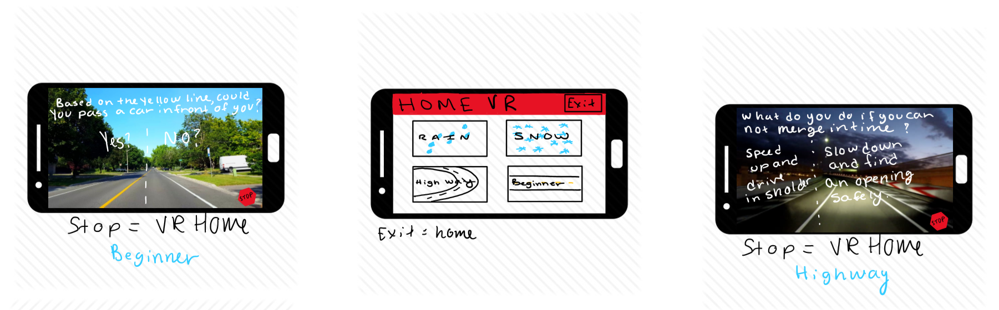

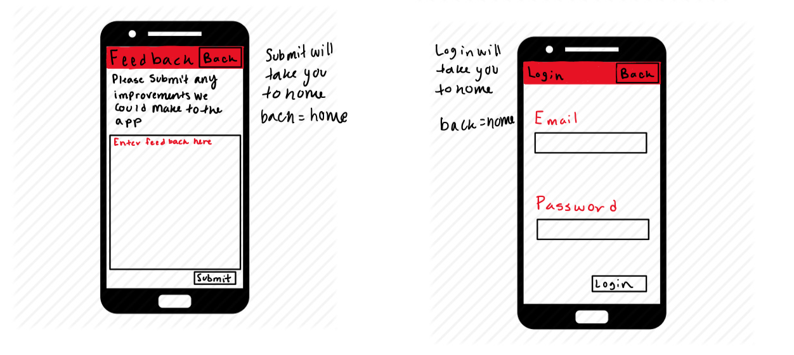

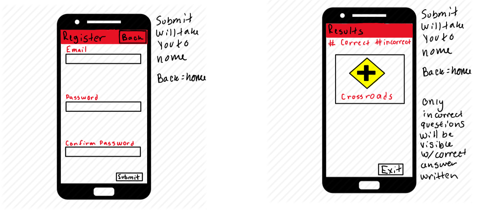

## Resources

These are some of the resources I used when embedding a VR Unity app inside an Android application that has large assets. There were many issues so I hope this helps :) :

- [Embedded Unity within Android App](https://medium.com/@davidbeloosesky/embedded-unity-within-android-app-7061f4f473a)

- [Integration Unity as a library in native Android app Version 2](https://forum.unity.com/threads/integration-unity-as-a-library-in-native-android-app-version-2.751712/)

- The first two links have a section for comments which helped me solve some errors.

- [Git LFS Tutorial (Migration + using Git LFS for already tracked asset)](https://github.com/git-lfs/git-lfs/wiki/Tutorial)

- [Git Large File Storage - How to Work with Big Files](https://www.youtube.com/watch?v=uLR1RNqJ1Mw)

- [INSTALL_FAILED_NO_MATCHING_ABIS when install apk](https://stackoverflow.com/questions/24572052/install-failed-no-matching-abis-when-install-apk)

- [How to solve “libmain.so not found” while using Unity as a library in Android application with latest AndroidX Versions out of ReactNative](https://stackoverflow.com/questions/58877735/how-to-solve-libmain-so-not-found-while-using-unity-as-a-library-in-android-ap)

- [Crashes on Android due to error "libmain.so not found"](https://github.com/f111fei/react-native-unity-view/issues/142#issuecomment-557162700)

- [Why is the Unity Video Player not working? (Video not playing in Android)](https://github.com/f111fei/react-native-unity-view/issues/77)

- [Fix Unity merge conflicts with these commands](https://stackoverflow.com/questions/38536896/git-reset-hard-origin-master-failing)
